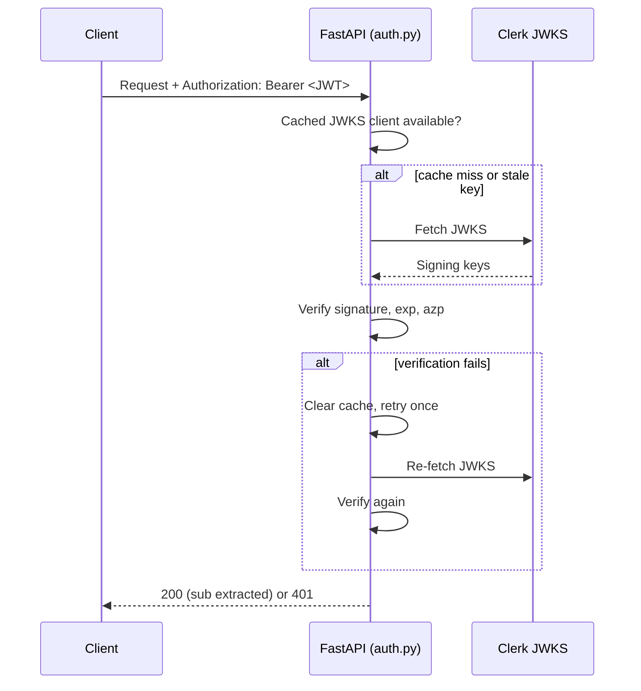

# Architecture Notes

Deeper detail on two design decisions worth a reviewer's attention, split out of the README because both merit more than a paragraph.

## Authentication: Clerk JWT verification

Every non-public route depends on `get_current_user` (`backend/auth.py`), which:

1. Extracts the bearer token via FastAPI's `HTTPBearer`.
2. Fetches the signing key for the token from Clerk's JWKS endpoint (`CLERK_JWKS_URL`), using `PyJWKClient` — this is cached globally (`_jwks_client`) so the JWKS document isn't re-fetched on every request.
3. Decodes and verifies the token with `PyJWT`, algorithms `RS256`/`RS512`, 120s leeway for clock skew.
4. On failure, clears the cached JWKS client and retries once — this handles the case where Clerk rotated its signing keys between the cache fetch and this request, without needing a background refresh job.
5. Checks the `azp` (authorized party) claim against `ALLOWED_ORIGINS`, when the claim is present — see below.



### Why `azp` instead of `aud`

Standard OAuth JWT validation checks the `aud` (audience) claim. Clerk session tokens don't reliably carry a conventional `aud` — Clerk's own guidance for manual backend verification is to check `azp` (the origin that requested the token) against a list of authorized origins instead, since neither `PyJWT` nor `python-jose` implement `azp` checking natively.

`_verify_authorized_party` in `auth.py` implements this, but **conservatively**: it only enforces the check when the token actually carries an `azp` claim *and* `ALLOWED_ORIGINS` is configured. This hasn't been validated against a real Clerk-issued token in this environment (no live Clerk credentials were available while building this), so it fails open on a missing claim rather than risk locking out legitimate sessions based on an unconfirmed assumption about Clerk's exact token shape. Documented as a known tradeoff in the README; worth tightening once verified against a real token.

## Database access: the `_pg()` placeholder translator

`backend/database.py` wraps every query through `_pg()`, which rewrites SQLite-style `?` placeholders into Postgres's `$1, $2, ...` positional syntax:

```python
def _pg(query: str) -> str:
    n, out = 0, []
    for ch in query:
        if ch == "?":
            n += 1
            out.append(f"${n}")
        else:
            out.append(ch)
    return "".join(out)
```

Every route in this codebase writes `?` placeholders and passes parameters as a tuple — `_pg()` converts the placeholder syntax immediately before `asyncpg` executes the query, but **parameters themselves are never interpolated into the SQL string**. They're passed through to `asyncpg.Connection.execute/fetch(*params)` as bound parameters, exactly as `$N` positional parameters are meant to be used. This is why the translator is injection-safe: it only rewrites placeholder *tokens*, and the actual untrusted data (user input) never touches string formatting at all.

The practical reason for this shim: every route was originally written against a simpler SQLite-style `?` convention (easier to read, matches most Python DB-API tutorials), and `_pg()` lets that convention keep working against a real Postgres/asyncpg backend without rewriting every query's placeholder syntax by hand.

## Why this file exists

The README documents *what* the app does and how to run it. This file exists for the two places where *why it's built this way* needed more than a sentence — if you're reviewing this repo as a portfolio piece, these are the two spots most worth reading closely.
